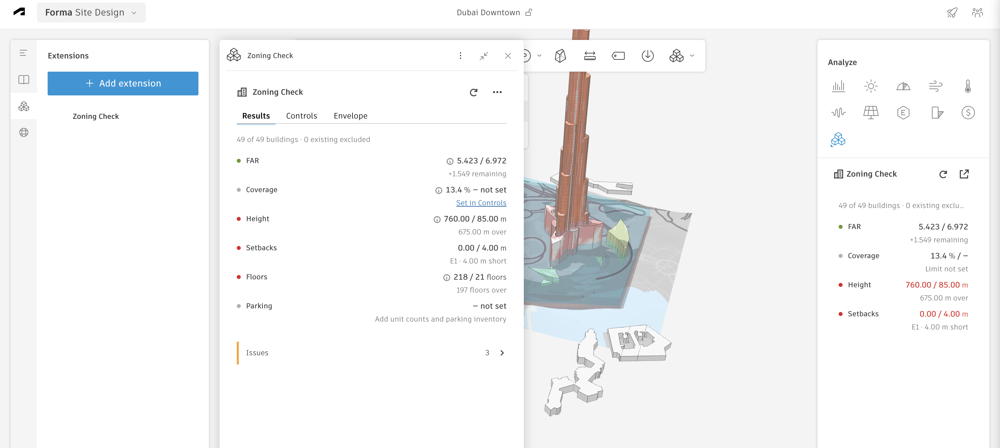
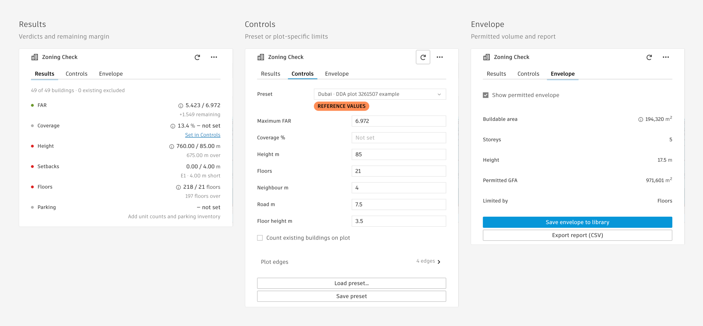

<p align="center">
  
</p>

# Zoning Check

An Autodesk Forma extension that checks a proposal against the parcel controls of its plot and generates the permitted envelope.

[](https://github.com/sharafutdinovdi/forma-zoning-check/actions/workflows/ci.yml)
[](https://github.com/sharafutdinovdi/forma-zoning-check/actions/workflows/codeql.yml)
[](LICENSE)




## What it does

- Verdicts for FAR, coverage, height, floors and setbacks, with the remaining margin or exceedance.
- A generated permitted envelope with buildable area, storeys and the binding constraint.
- Presets for Dubai, Riyadh, Serbia, Germany, the Netherlands and Spain, plus plot-specific manual entry.
- A CSV report carrying every measured value, limit and recorded source.

## How it is used

1. Draw one closed **site limit** around the plot.
2. Add or import proposal buildings; existing buildings are excluded unless **Count existing buildings on plot** is enabled.
3. In **Controls**, pick a preset or enter the plot controls, classify the plot edges and supply street width where required.

4. Read the verdicts and 3D tint: green passes, red fails, grey needs data; inspect the generated volume in **Envelope**.

5. In **Envelope**, choose **Export report (CSV)** or **Save envelope to library** for later placement in Forma.



## Presets

| Preset | What it fixes | Source | Reference/Plot-specific |
| --- | --- | --- | --- |
| [Dubai · DBC fallback G+4](presets/dbc-g4.json) | 5 floors; height 30 m; neighbour/road 3.75/0 m | [DBC B.4.2](https://dmpmedia.dm.gov.ae/uploads/2021/12/Dubai%20Building%20Code_English_2021%20Edition_compressed.pdf) | Reference |
| [Dubai · DBC fallback G+9](presets/dbc-g9.json) | 10 floors; height 60 m; neighbour/road 7.5/0 m | [DBC B.4.2](https://dmpmedia.dm.gov.ae/uploads/2021/12/Dubai%20Building%20Code_English_2021%20Edition_compressed.pdf) | Reference |
| [Dubai · DDA 3261507 example](presets/dda-3261507.json) | FAR 6.972; 21 floors; 85 m; neighbour/road 4/7.5 m | [DDA plot](https://gis.dda.gov.ae/DIS?PlotNumber=3261507&handler=PlotInfo) | Reference |
| [Dubai · DDA 3262935 example](presets/dda-3262935.json) | FAR 2.161; 16 floors; neighbour/road 5/10 m | [DDA plot](https://gis.dda.gov.ae/DIS?PlotNumber=3262935&handler=PlotInfo) | Reference |
| [Dubai · Downtown / Emaar](presets/dubai-master.json) | Manual plot controls | [Emaar](https://www.emaar.com/en/our-communities/downtown-dubai) | Plot-specific |
| [Riyadh · MOMAH villa R3](presets/riyadh-villa.json) | Coverage 75%; 2 floors; neighbour 1.5 m; roads by width | [MOMAH §§3.1, 4.1](https://momah.gov.sa/sites/default/files/2025-11/ashtratat%20ansha%20almbany%20alsknyt9%20ywlyh%202024.pdf) | Reference |
| [Riyadh · MOMAH apartment R2](presets/riyadh-apartment.json) | Coverage 65%; height 23 m; neighbour 2–3 m; roads by width | [MOMAH §§3.2, 4.2](https://momah.gov.sa/sites/default/files/2025-11/ashtratat%20ansha%20almbany%20alsknyt9%20ywlyh%202024.pdf) | Reference |
| [Riyadh · KAFD / Qiddiya](presets/riyadh-special.json) | Manual plot controls | [Plot building-system service](https://www.alriyadh.gov.sa/ar/services/40?mainServiceCode=2) | Plot-specific |
| [Serbia · family housing fallback](presets/rs-general-family-fallback.json) | Coverage 40%; FAR 1.2; 4 floors; road/north/south 3/1.5/2.5 m | [Rulebook arts. 36, 49–51](https://www.mgsi.gov.rs/sites/default/files/Pravilnik%20o%20opstim%20pravilima%20za%20parcelaciju%2C%20regulaciju%20i%20zgradnju.pdf) | Reference |
| [Germany · WA orientation](presets/de-bauNVO-WA-orientation.json) | GRZ 0.4; GFZ 1.2; setbacks max(0.4H, 3 m) | [BauNVO §17](https://www.gesetze-im-internet.de/baunvo/__17.html); [BauO Bln §6](https://gesetze.berlin.de/bsbe/document/jlr-NNLBE00004835NN00000000027) | Reference |
| [Netherlands · Valkenswaard agricultural](presets/nl-valkenswaard-buitengebied2-agri.json) | Bouwvlak; height 10 m; eaves/road-axis limits need separate review | [Plan arts. 3.2.1–3.2.2](https://www.ruimtelijkeplannen.nl/documents/NL.IMRO.0858.BPbuitengebied2-VA01/r_NL.IMRO.0858.BPbuitengebied2-VA01.html) | Reference |
| [Spain · Madrid NZ8 grade 2](presets/es-madrid-nz8-grade2.json) | Coverage 30%; FAR 0.5; 3 floors; cornice 10.5 m; road/side 7/5 m; rear max(2H/3, 4 m) | [PGOUM arts. 8.8.6–8.8.10](https://transparencia.madrid.es/UnidadesDescentralizadas/UDCUrbanismo/PGOUM/CompendioNNUU/ficheros/COMPENDIO_MPG_NNUU_24_09_2025.pdf) | Reference |
| [Custom](presets/custom.json) | Manual plot controls | User-entered | Plot-specific |

## Install in Forma

1. Serve the app at `http://localhost:5173/` for local use, or replace that URL below with your deployed HTTPS URL.
2. Open **Extensions → Manage extensions → Create extension** and enter:

   | Field | Value |
   | --- | --- |
   | Name | Zoning Check |
   | Provider | Dinar Sharafutdinov · dstools |
   | Description | Check proposal massing against parcel controls and generate an envelope. |
   | Text to show for the installed extension | Check plot controls and export results. |
   | Description link | `https://github.com/sharafutdinovdi/forma-zoning-check` |
   | Icon | [256 px](assets/icon-256.png) or [512 px](assets/icon-512.png) |
   | Legal information | MIT licence; estimated massing check, not a compliance statement. |

3. Add the project ID (`pro_…`) to the **project allowlist**.
4. Add an **Embedded view**: URL `http://localhost:5173/`, placement `RIGHT_MENU_ANALYSIS_PANEL`.
5. Paste into **Buttons**:

   ```yaml
   - label: Zoning Check
     actions:
       click:
         type: OPEN_FLOATING_PANEL
         url: http://localhost:5173/
         preferredSize:
           width: 440
           height: 720
   ```

6. In the project, open **Extensions → Add extension → Unpublished** and install using the extension ID.

## Develop

Use Node.js 20.19+ or 22.12+ and npm.

```sh
npm ci
npm run dev
```

| Fixture URL | Preview |
| --- | --- |
| `http://localhost:5173/?fixture=1` | Results, Controls and Envelope; full panel or mini view below 300 px. |
| `http://localhost:5173/?fixture=1&state=no-site-limit` | Missing site limit. |
| `http://localhost:5173/?fixture=1&state=no-buildings-on-plot&existing=1` | Excluded existing building and the action to include it. |
| `http://localhost:5173/?fixture=1&state=loading` | Loading state. |
| `http://localhost:5173/?fixture=1&state=error` | Recoverable error. |
| `http://localhost:5173/?fixture=1&host=forma` | Host transparency over a checkerboard. |

Fixtures use synthetic data; saving to the Forma library requires the live host.

## Scope

This is an estimated massing check, not legal compliance or approval; current plot documents take precedence over presets.
It does not check parking, podium controls or per-floor coverage, or look up rules automatically by coordinates.
Missing limits or geometry remain incomplete; floor counts and GFA may be estimated.
The envelope does not shrink its footprint to meet coverage; coverage warnings require a revised building shape.

## Verified

Live captures from **2026-09-22** show v4 in Forma's EU region with SDK **0.96.0**.
This covered the floating and mini panels, controls, verdicts, the 3D tint, the generated envelope, the CSV download and saving the envelope to the project Library.
Bouwvlak mode and the European presets were exercised against the shipped rules and geometry, not on a European site; run them on a local plot before relying on the numbers.

## Build your own

Run `npm create forma-extension@latest my-extension` to scaffold a Forma extension with the same native UI and host adapter.
The generated project comes from [autodesk-forma-extension-template](https://github.com/sharafutdinovdi/autodesk-forma-extension-template) and depends on [forma-extension-kit](https://github.com/sharafutdinovdi/forma-extension-kit), which carries the proposal, geometry and cross-panel adapters this extension uses.

## Licence

[MIT](LICENSE), Copyright (c) 2026 Dinar Sharafutdinov.
