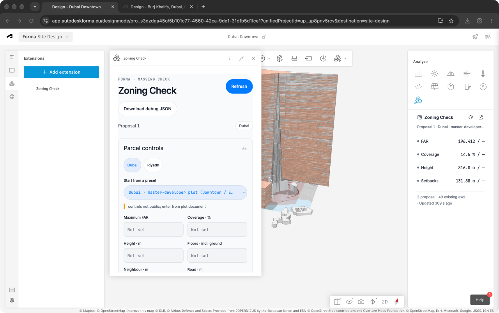
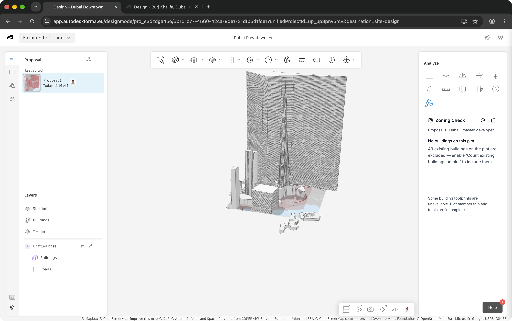

# Zoning Check

Check proposal massing against parcel controls in Autodesk Forma, share presets, and export the verdict.




Owner-captured Forma sessions, 2026-09-21, before the v2.3 interface changes; the mini screenshot records an earlier geometry failure.
Current v2.3 synthetic previews: [full panel](docs/screens/ready-440.png), [mini panel](docs/screens/mini-ready-240.png), [collapsed controls](docs/screens/controls-collapsed-440.png), [actions menu](docs/screens/overflow-menu-440.png).

## What it does

- Compares FAR, coverage, height, floors and setbacks with parcel limits; missing limits or geometry remain incomplete.
- Shows results in a floating panel and compact analysis view, with temporary 3D building tints and automatic proposal refresh.
- Shares controls through JSON preset files and exports a CSV with measurements, limits, source attribution and caveats.

## How a coordinator uses it

1. Draw one closed **site limit** around the parcel.
2. Add proposal buildings inside it; existing context buildings are excluded unless **Include existing** is enabled.
3. Open **Parcel controls**, choose a preset or **Load preset…**, then classify road edges and enter any missing plot limits.
4. Read the verdict and inspect the 3D tint: green passes local checks, red fails, grey needs more data.
5. Open **… → Export CSV** to share the report; **Save preset** shares the current controls for another project.

Jurisdiction comes from the preset; **Rules:** identifies the active rule family.
Custom retains the previous jurisdiction, and manual edits retain source attribution.
Controls are stored per proposal and collapse after a preset is selected and saved.
Imported files clear road-edge selections; select roads again on the target plot.
For Riyadh rules, select the front road first and enter the street width.
The [preset file schema](docs/preset-schema.md) describes validation and the [downloadable presets](presets/).

## Presets and sources

The table below is generated from [src/rules.ts](src/rules.ts); limits are starting points for review against the current parcel document.
DDA examples apply to the named plots, and plot-specific entries deliberately leave limits blank.

<!-- PRESETS:START -->
| Preset | Limits | Source | Caveat |
| --- | --- | --- | --- |
| [Dubai · DBC fallback G+4](presets/dbc-g4.json) | G+4; height 30 m (6 × floors); neighbour 3.75 m; road 0 m | [DBC 2021 · B.4.2](https://dmpmedia.dm.gov.ae/uploads/2021/12/Dubai%20Building%20Code_English_2021%20Edition_compressed.pdf) | fallback only; plot DCR/affection plan prevails |
| [Dubai · DBC fallback G+9](presets/dbc-g9.json) | G+9; height 60 m (6 × floors); neighbour 7.5 m; road 0 m | [DBC 2021 · B.4.2](https://dmpmedia.dm.gov.ae/uploads/2021/12/Dubai%20Building%20Code_English_2021%20Edition_compressed.pdf) | fallback only; plot DCR/affection plan prevails |
| [Dubai · DDA plot 3261507 (Al Jadaf) example](presets/dda-3261507.json) | FAR 6.972; G+20; height 85 m; neighbour 4 m; road 7.5 m | [DDA · plot 3261507](https://gis.dda.gov.ae/DIS?PlotNumber=3261507&handler=PlotInfo) | Example only: 4 / 7.5 / 4 / 4 m approximated as neighbour 4 m, road 7.5 m; podium controls excluded. |
| [Dubai · DDA plot 3262935 (Al Jadaf) example](presets/dda-3262935.json) | FAR 2.161; G+15; neighbour 5 m; road 10 m | [DDA · plot 3262935](https://gis.dda.gov.ae/DIS?PlotNumber=3262935&handler=PlotInfo) | Example only: 5 / 10 / 5 / 5 m approximated as neighbour 5 m, road 10 m. |
| [Dubai · master-developer plot (Downtown / Emaar)](presets/dubai-master.json) | Enter from plot document | [Emaar · Downtown Dubai](https://www.emaar.com/en/our-communities/downtown-dubai) | controls not public; enter from plot document |
| [Riyadh · MOMAH 2024 villa (R3)](presets/riyadh-villa.json) | coverage 75%; G+1; neighbour 1.5 m; road max(width/5, 3 m front / 2 m other) | [MOMAH 2024 · §§3.1, 4.1 (Arabic)](https://momah.gov.sa/sites/default/files/2025-11/ashtratat%20ansha%20almbany%20alsknyt9%20ywlyh%202024.pdf) | 2 floors + roof annex; annex and basement classification not checked. Enter street width and classify road edges; plot system prevails. |
| [Riyadh · MOMAH 2024 apartment (R2)](presets/riyadh-apartment.json) | coverage 65%; height 23 m; road max(width/5, 3 m front / 2 m other); neighbour 2 / 3 m by floors | [MOMAH 2024 · §§3.2, 4.2 (Arabic)](https://momah.gov.sa/sites/default/files/2025-11/ashtratat%20ansha%20almbany%20alsknyt9%20ywlyh%202024.pdf) | Ground coverage only; neighbour 2 m for ≤5 floors, 3 m for >5. Roof annex excluded; enter street width. Above 23 m is outside this preset’s scope. |
| [Riyadh · KAFD / Qiddiya parcel](presets/riyadh-special.json) | Enter from plot document | [Riyadh · plot building-system service](https://www.alriyadh.gov.sa/ar/services/40?mainServiceCode=2) | controls not public; enter from plot document; special-authority parcel controls prevail |
| [Custom](presets/custom.json) | Enter from plot document | User-entered | Enter controls from the current plot document. |
<!-- PRESETS:END -->

## Install in Forma

Serve the app at a URL accessible to the Forma browser; local development uses `http://localhost:5173/`.
For a shared installation, use the deployed HTTPS URL in every URL field below.

Open **Extensions → Manage extensions → Create extension** and enter:

| Field | Value |
| --- | --- |
| Name | Zoning Check |
| Provider | Dinar Sharafutdinov · dstools |
| Description | Check proposal FAR, coverage, height and setbacks against parcel controls; share presets and export a CSV report. |
| Text to show for the installed extension | Check proposal massing against plot controls and export results to CSV. |
| Description link | `https://github.com/sharafutdinovdi/forma-zoning-check` |
| Icon | [assets/icon-256.png](assets/icon-256.png), or [512 px](assets/icon-512.png) where required. |
| Legal information | MIT licence; estimated massing check, not a compliance statement. |

Add the target project ID (`pro_…`) to the extension's **project allowlist**.
Add an **Embedded view** with URL `http://localhost:5173/` and placement `RIGHT_MENU_ANALYSIS_PANEL`.
In **Buttons**, paste this YAML:

```yaml
- label: Zoning Check
  actions:
    click:
      type: OPEN_FLOATING_PANEL
      url: http://localhost:5173/
      preferredSize:
        width: 440
        height: 720
```

The YAML retains the [Autodesk floating-panel configuration example](https://forums.autodesk.com/t5/forma-site-design-developer/how-can-i-make-an-extension-modal-cover-the-entire-window/m-p/12281463/highlight/true).
Autodesk's [extension setup guide](https://aps.autodesk.com/en/docs/forma/v1/overview/getting-started/) covers registration.
Install the extension in the allowlisted project through **Extensions → Add extension → Unpublished** using its extension ID; installation is per project, as described in [Autodesk's installation guide](https://www.autodesk.com/learn/ondemand/tutorial/add-extensions-in-forma).

The analysis view uses the mini layout below 300 px; the toolbar button opens a preferred 440 × 720 px floating panel.
The mini view's open button also requests the floating panel; an unavailable SDK action displays the toolbar fallback.

## Develop

Use Node.js 20.19+ or 22.12+ and npm.

```sh
npm ci
npm run dev
```

Vite uses port 5173 with `strictPort`; reuse an existing server on this port.

| Fixture URL | Preview |
| --- | --- |
| `http://localhost:5173/?fixture=1` | Synthetic ready report; 440 px full panel or 240 px mini view. |
| `http://localhost:5173/?fixture=1&state=no-site-limit` | Actionable missing-site-limit state. |
| `http://localhost:5173/?fixture=1&state=no-buildings-on-plot&existing=1` | Excluded existing building and Include existing action. |
| `http://localhost:5173/?fixture=1&state=loading` | Loading state. |
| `http://localhost:5173/?fixture=1&state=error` | Recoverable error state. |
| `http://localhost:5173/?fixture=1&host=forma` | Transparent body and root over a dark checkerboard. |

Fixture mode is ignored in an iframe; `host=forma` changes the standalone fixture's appearance without starting an SDK connection.
An embedded view sets `data-host="forma"`; standalone mode sets `data-host="standalone"`.
The root has 12 px inner padding and no outer border or radius.

```sh
npm run typecheck && npm run build
curl -s -o /dev/null -w '%{http_code}\n' 'http://localhost:5173/?fixture=1'
```

Production output is written to `dist/`.
The lockfile pins runtime dependencies; v2.3 adds none.
In Forma, **… → Debug** downloads element diagnostics for the current snapshot.

## What it does not do

- Establish regulatory compliance, authority approval, permit eligibility or current legal applicability of a preset.
- Check parking capacity, podium controls, per-floor coverage, annex/basement classification or the regulatory road-level height datum.
- Treat missing geometry or limits as a pass: floor counts and GFA may be estimated, and crossing buildings contribute whole-building GFA while coverage is clipped to the plot.

Current plot documents take precedence over presets.
Illustrative 3D extrusions omit polygons containing holes; numeric calculations retain those holes.

## Status

Owner-provided live evidence on **2026-09-21** confirms the floating and right-side panels, visible 3D tint, and exclusion of 49 existing buildings through base-group ancestry.
The floating screenshot displays two proposal buildings; the earlier mini screenshot records a native-building geometry failure.
These observations do not validate the displayed measurements or every geometry provider.

The v2.3 interface, JSON validation and round trips, stored controls, responsive layouts and host transparency are verified locally with synthetic fixtures.
The new interface and transparent background still require a live Forma check in both panels; the supplied live images show the previous version.
Current authority documents, overlay alignment/cleanup and each native geometry fallback have not been independently verified live in this task.
[NOTES.md](NOTES.md) records commands, build sizes, evidence boundaries and remaining checks.

## Licence

[MIT License](LICENSE), Copyright (c) 2026 Dinar Sharafutdinov.
